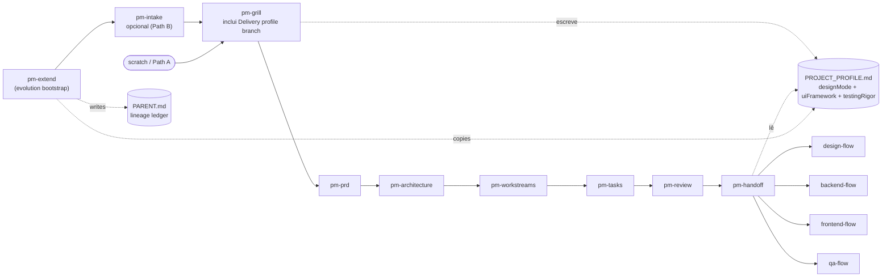

# pm-extend Implementation Plan

> **For Claude:** REQUIRED SUB-SKILL: Use superpowers:executing-plans to implement this plan task-by-task.

**Goal:** Ship `pm-extend` — a bootstrap skill that materializes a child slug as an explicit evolution of a parent slug, plus the lineage-aware edits in 8 existing skills that honor the `PARENT.md` marker.

**Architecture:** New single-responsibility skill at `skills/pm-extend/SKILL.md` writes three files into `.pm/<child>/` (`PARENT.md`, inherited `PROJECT_PROFILE.md`, seeded `INTAKE.md`) then hands off to `pm-flow`. Eight existing skills gain a "if `.pm/<feature>/PARENT.md` exists, read parent artifacts and mark inherited items" branch. No breaking changes — standalone slugs (no `PARENT.md`) behave identically to today.

**Tech Stack:** Markdown-only edits to skill files. No code. "Tests" are manual dry-runs against a fixture `.pm/` structure plus reading the resulting SKILL.md to verify contracts hold.

**Design doc:** `docs/plans/2026-04-22-pm-extend-design.md` (committed in `4b3221c`).

**Release target:** v1.3.0 of the plugin. Skill count 43 → 44.

---

## Conventions for this plan

- **Skill-file TDD substitute:** each skill edit has a "verify" step — either grep for a required invariant, or dry-run the mental flow against a fixture structure (instructions in Task 2).
- **Commits:** one commit per phase (not per task) to keep the history readable. Commit messages follow the repo's prefix style (`docs:`, `chore:`, `skills:`, `pm-extend:`).
- **Co-author tag:** match the committed design doc — include `Co-Authored-By: Claude Opus 4.7 (1M context) <noreply@anthropic.com>` on every commit.
- **Paths are relative to repo root** `/Users/diegocredidio/Documents/repogit/project-skills`.
- **Do not introduce TDD test files** — this codebase has no test runner; the skills are prompts. Verification is manual.

---

## Phase 1 — Build `pm-extend` skill (standalone, direct-invocation usable)

### Task 1.1: Create the pm-extend SKILL.md

**Files:**
- Create: `skills/pm-extend/SKILL.md`

**Step 1: Write the SKILL.md**

Write exactly this content:

`````markdown
---
name: pm-extend
description: Bootstrap a child feature slug as an explicit evolution of an existing parent slug. Writes `.pm/<child>/PARENT.md` (lineage ledger), copies `.pm/<parent>/PROJECT_PROFILE.md` (inherited or overridden), and seeds `.pm/<child>/INTAKE.md` with a Parent header + improvement summary + gap list derived from parent artifacts. Then hands off to pm-flow, which detects PARENT.md and auto-selects Path B (gap-fill) mode. Use when user says "extend <feature>", "evolve <feature>", "add <improvement> to <feature>", "melhoria em <feature>", or when pm-flow's Step 1 evolution branch invokes it. Not for greenfield planning (use pm-flow with a new slug) or for generic cross-feature discussions.
---

# PM Extend — Evolution Bootstrapper

Materialize a child slug that inherits from a parent slug. Single responsibility: write the lineage baseline and hand off to pm-flow.

## How to run

### Step 1: Collect inputs

Gather three values — ask one at a time if missing:

1. **Parent slug** — must exist at `.pm/<parent>/`. If user didn't supply, ask: "Which existing feature are you evolving? Available: [list of `.pm/*` subdirectories]."
2. **Child slug** — kebab-case name for the new feature. Offer a default derived from the user's improvement description (e.g., "add 2FA to auth" → suggest `2fa`). Ask: "Child slug `<suggested>`? Or rename."
3. **Improvement summary** — 1–5 sentence paragraph. Ask: "Describe what this evolution adds or changes vs. the parent."

### Step 2: Validate

Abort with a precise message on any of:

- Parent does not exist at `.pm/<parent>/` → "No slug `<parent>` under `.pm/`. Available: [list]. Maybe you meant pm-flow for a greenfield slug?"
- Child slug is not kebab-case → "Child slug must be kebab-case (lowercase, hyphens). Got: `<value>`."
- Child slug would collide with `.pm/<child>/` that already exists → prompt: "`.pm/<child>/` already exists. Options: [continue] (keep folder, only add/update PARENT.md + profile), [rename] (new slug), [abort]."

On `continue` with an existing folder, skip Step 4 for INTAKE.md — only write PARENT.md and PROJECT_PROFILE.md.

### Step 3: Audit parent artifacts

List what the parent folder contains. This feeds the PARENT.md artifact reference table.

Check for:
- `.pm/<parent>/PRD.md`
- `.pm/<parent>/ARCHITECTURE.md`
- `.pm/<parent>/GRILL_SUMMARY.md`
- `.pm/<parent>/PROJECT_PROFILE.md`
- `.backend/<parent>/BACKEND_BRIEF.md`, `BACKEND_STACK.md`, `BACKEND_DATA.md`, `BACKEND_API.md`
- `.frontend/<parent>/FRONTEND_BRIEF.md`, `FRONTEND_STACK.md`, `FRONTEND_ROUTES.md`
- `.design/<parent>/DESIGN_BRIEF.md`, `TOKENS.md`, `COMPONENT_SPECS.md`
- `.qa/<parent>/QA_BRIEF.md`, `QA_STRATEGY.md`, `TEST_CASES.md`

Record presence (✓) / absence (✗) for each.

If `PRD.md` and `ARCHITECTURE.md` are both absent, warn: "Parent `<parent>` has no PRD or ARCHITECTURE — the lineage will be thin. Proceed? [Y/n]"

### Step 4: Resolve profile inheritance

Read `.pm/<parent>/PROJECT_PROFILE.md`. If missing, tell the user: "Parent has no PROJECT_PROFILE.md — can't inherit. Fill it now for the parent via pm-grill Step 1.5 prompt, OR fill the child's profile from scratch?" Proceed based on choice.

If present, default to inheriting verbatim. Prompt once:

> "Parent profile: designMode=<value>, uiFramework=<value>, testingRigor=<value>. Inherit as-is? [Y/n]"

On `n`, walk each of the three fields — for each: "Keep `<parent-value>` or change to: [options]?" Record overrides + reason in PARENT.md's Profile inheritance table.

### Step 5: Write PARENT.md

Save to `.pm/<child>/PARENT.md`:

```markdown
# Parent: <parent-slug>

**Child slug:** <child-slug>
**Created:** <today ISO date>
**Improvement summary:** <the paragraph from Step 1>

## Artifacts referenced from parent

| Path | Purpose |
|------|---------|
| .pm/<parent>/PRD.md | Source FR-XXX the child extends or modifies |
| .pm/<parent>/ARCHITECTURE.md | System baseline the child builds on |
| .pm/<parent>/PROJECT_PROFILE.md | Profile inherited into child |
| .pm/<parent>/GRILL_SUMMARY.md | Decisions already resolved (skip in gap-fill) |
| .backend/<parent>/BACKEND_API.md | API surface the child may extend (if present) |
| .backend/<parent>/BACKEND_DATA.md | Data model the child may extend (if present) |
| .frontend/<parent>/FRONTEND_ROUTES.md | Route map the child may extend (if present) |
| .design/<parent>/COMPONENT_SPECS.md | Component inventory the child may reuse (if present) |

Include only the rows where the parent actually has the file. Drop rows for missing artifacts.

## Profile inheritance

| Field | Parent value | Child value | Override? |
|-------|--------------|-------------|-----------|
| designMode | <value> | <value> | no / yes — <reason> |
| uiFramework | <value> | <value> | no / yes — <reason> |
| testingRigor | <value> | <value> | no / yes — <reason> |
```

### Step 6: Copy / override PROJECT_PROFILE.md

Write `.pm/<child>/PROJECT_PROFILE.md` with the resolved values (inherited or overridden). Format matches pm-grill's canonical output:

```markdown
# Project Profile
designMode: <value>
uiFramework: <value>
testingRigor: <value>
```

### Step 7: Seed INTAKE.md

Save to `.pm/<child>/INTAKE.md`:

```markdown
# Intake Analysis: <child-slug>

**Source:** Evolution of `<parent-slug>` — see `PARENT.md`
**Analyzed:** <today>
**Mode:** evolution (lineage-aware)

## Improvement summary
<paragraph from Step 1>

## Inherited from parent (✅ clear — do NOT re-ask)

Pull the following verbatim from parent artifacts and list here so pm-grill can skip them:

- Problem domain: <from .pm/<parent>/PRD.md "Problem Statement" section — first paragraph>
- Target users: <from .pm/<parent>/GRILL_SUMMARY.md "Target Users" section>
- Stack: <from .pm/<parent>/ARCHITECTURE.md "Stack Decisions" table — one-line summary>
- Profile: designMode=<value>, uiFramework=<value>, testingRigor=<value>

If a source file is missing, write "(parent has no <section>)" instead of inventing content.

## What needs clarification for this evolution ⚠️

Derive these questions by reading the improvement summary and comparing to parent artifacts. Examples of typical questions:

| # | Element | Why it matters for the child | Priority |
|---|---------|------------------------------|----------|
| A1 | Scope boundary | Does this add new FR-XXX or modify existing FR-YYY in parent? | Critical |
| A2 | Data model delta | New entities? New columns on existing entities? Migration strategy? | Important |
| A3 | API contract impact | New endpoints only, or does this change existing endpoints? | Important |

## What's missing entirely ❌

| # | Category | Why it matters | Priority |
|---|----------|---------------|----------|
| M1 | Success metric for the evolution | Parent's metrics may not apply to the improvement alone | Critical |

## Grill question list (for pm-grill)

### Critical — must resolve before architecture
1. <derived from A1 + M1>
2. <...>

### Important — should resolve before tasks
1. <derived from A2 / A3>

### Minor
(none unless the improvement summary is notably vague)
```

Note: pm-extend is NOT pm-intake. This seeded INTAKE is deliberately thin — pm-grill (Path B) does the actual interrogation.

### Step 8: Hand off to pm-flow

Announce:

> "Child slug `<child>` bootstrapped as evolution of `<parent>`. Files written:
> - .pm/<child>/PARENT.md (lineage ledger)
> - .pm/<child>/PROJECT_PROFILE.md (inherited from parent)
> - .pm/<child>/INTAKE.md (seeded with improvement + gap list)
>
> Handing off to pm-flow. It will detect PARENT.md, auto-select Path B (gap-fill), and run pm-grill asking only evolution-specific questions."

Invoke `pm-flow` with the child slug. Do not restart the grill here; pm-flow's Step 2 takes it from here.

## Rules

- Never overwrite `.pm/<child>/INTAKE.md` if the child folder already existed before this invocation (continue-mode) — only PARENT.md and PROJECT_PROFILE.md are safe to refresh.
- Never read parent code or parent PR history — only the `.pm/<parent>/` + discipline folder artifacts. This skill is spec-aware, not code-aware.
- Never invent parent artifacts. If `.pm/<parent>/PRD.md` is missing, leave the corresponding "Inherited from parent" bullet blank and flag the gap.
- FR-IDs in the child's eventual PRD continue from `max(parent FR-XXX) + 1` — but that's pm-prd's job, not this skill's. Just note it in PARENT.md for pm-prd to read.
- Lineage is flat. If the user tries to extend an already-extended slug, allow it mechanically (parent has its own PARENT.md, which this skill ignores), but do NOT chain references. Document multi-level gap in Decision 9 of the design doc.
- Profile changes (override mode) are recorded with a reason in PARENT.md. Silent overrides are a footgun.
- This skill always ends by invoking pm-flow. Do not produce a standalone "done" state — the flow continues.
`````

**Step 2: Verify the SKILL.md contract**

Run: `grep -c "^## " skills/pm-extend/SKILL.md`
Expected: `1` (one `## How to run`) plus `## Rules` → total `2`

Run: `grep -E "^### Step [0-9]+:" skills/pm-extend/SKILL.md | wc -l`
Expected: `8` (Steps 1 through 8)

Run: `grep -c "PARENT.md" skills/pm-extend/SKILL.md`
Expected: `>= 5`

Run: `head -3 skills/pm-extend/SKILL.md`
Expected: starts with `---` then `name: pm-extend` then `description:`

### Task 1.2: Fixture directory for manual dry-run

**Files:**
- (temporary) create a local fixture under a git-ignored path to dry-run pm-extend mentally. Do NOT commit the fixture.

**Step 1: Create a temporary fixture**

```bash
mkdir -p /tmp/pm-extend-fixture/.pm/auth
cat > /tmp/pm-extend-fixture/.pm/auth/PRD.md <<'EOF'
# PRD: Auth
## 1. Problem Statement
Users need to sign in.
## 7. Functional Requirements
- FR-001: Email + password login
- FR-002: Password reset
EOF
cat > /tmp/pm-extend-fixture/.pm/auth/ARCHITECTURE.md <<'EOF'
# Technical Architecture: Auth
## 2. Stack Decisions
| Layer | Choice |
|-------|--------|
| Backend | Node + Fastify |
| DB | Postgres |
EOF
cat > /tmp/pm-extend-fixture/.pm/auth/GRILL_SUMMARY.md <<'EOF'
# Grill Summary: Auth
## Target Users
End consumers of the SaaS dashboard.
EOF
cat > /tmp/pm-extend-fixture/.pm/auth/PROJECT_PROFILE.md <<'EOF'
# Project Profile
designMode: shadcn-theme
uiFramework: shadcn/ui
testingRigor: mvp
EOF
```

**Step 2: Dry-run verification**

Mentally walk the pm-extend SKILL.md against this fixture with inputs `parent=auth`, `name=2fa`, `improvement="Add TOTP second factor to login"`.

Check each step produces the expected output:

- Step 3 artifact audit finds: PRD ✓, ARCHITECTURE ✓, GRILL_SUMMARY ✓, PROJECT_PROFILE ✓; all discipline folders ✗
- Step 5 PARENT.md table includes only the 4 present rows (drops missing discipline rows)
- Step 6 PROJECT_PROFILE.md is byte-identical to parent's (no override)
- Step 7 INTAKE.md "Inherited from parent" section includes Problem/Users/Stack/Profile, each with a source line pointing at the correct parent file

If any step fails this dry-run, edit SKILL.md and re-verify. Do not commit broken contracts.

**Step 3: Clean up fixture**

```bash
rm -rf /tmp/pm-extend-fixture
```

### Task 1.3: Commit Phase 1

**Step 1: Stage and commit**

```bash
git add skills/pm-extend/SKILL.md
git commit -m "$(cat <<'EOF'
pm-extend: new skill for lineage-aware feature evolution

Writes .pm/<child>/PARENT.md + inherited PROJECT_PROFILE.md + seeded
INTAKE.md, then hands off to pm-flow which will auto-select Path B
when PARENT.md is present. Standalone-usable via direct invocation;
pm-flow entry-point changes follow in a separate commit.

Co-Authored-By: Claude Opus 4.7 (1M context) <noreply@anthropic.com>
EOF
)"
```

**Step 2: Verify commit**

Run: `git log --oneline -1`
Expected: first line starts with `pm-extend: new skill for lineage-aware feature evolution`

---

## Phase 2 — `pm-flow` entry-point changes

### Task 2.1: Read current pm-flow Step 1 and Step 2

**Files:**
- Modify: `skills/pm-flow/SKILL.md` (Steps 1 and 2)

**Step 1: Re-read the current Step 1 and Step 2**

Run: `sed -n '31,50p' skills/pm-flow/SKILL.md`

Confirm the current text matches:
- Step 1 asks "What feature or project do you want to plan?" and kebab-cases the answer.
- Step 2 asks about existing material (Path A / Path B branch).

### Task 2.2: Rewrite Step 1 to offer evolution branch

**Step 1: Replace the Step 1 body**

Edit `skills/pm-flow/SKILL.md`. Replace the current Step 1 section (from `### Step 1: Setup` through the end of that section, stopping before `### Step 2:`) with:

```markdown
### Step 1: Setup

Check if `.pm/` directory exists. If not, create it.

Scan `.pm/` for existing slugs. If at least one exists, list them with a short readiness indicator (which artifacts each has) and ask:

> "Existing features under `.pm/`:
> - auth (PRD ✓, ARCHITECTURE ✓, handed off)
> - dashboard (PRD ✓, no handoff yet)
>
> Is this a new feature or an evolution of one of those?
> [new / evolution of <slug> / cancel]"

**If the user picks `evolution of <slug>`**, invoke `pm-extend` with `parent=<slug>`. Ask the user for the child slug name and the improvement summary, then let `pm-extend` run Steps 1–7 and return control here. Do NOT proceed to Step 2 — `pm-extend` ends by invoking `pm-flow` again on the child slug, which will re-enter Step 1 and detect `.pm/<child>/PARENT.md`.

**If the user picks `new`** (or `.pm/` is empty), ask: "What feature or project do you want to plan?" Create a subfolder name from the answer (kebab-case).

**If the subfolder already exists AND contains `PARENT.md`**, skip the existing-material prompt — `PARENT.md` is the existing material. Continue directly to Step 3 in Path B mode.

**If the subfolder already exists WITHOUT `PARENT.md`**, show what's there and ask: "Continue from where you left off, or start fresh?"
```

**Step 2: Verify the edit**

Run: `grep -n "evolution of" skills/pm-flow/SKILL.md`
Expected: at least one match in Step 1 body.

Run: `grep -n "PARENT.md" skills/pm-flow/SKILL.md`
Expected: at least two matches (one in the evolution branch, one in the auto-Path-B branch).

### Task 2.3: Update Step 2 to auto-select Path B when PARENT.md exists

**Step 1: Edit Step 2**

Edit `skills/pm-flow/SKILL.md`. Replace the current Step 2 body with:

```markdown
### Step 2: Choose entry point

If `.pm/<feature>/PARENT.md` exists, skip the prompt and go directly to Path B (pm-intake already ran — the seeded INTAKE.md from pm-extend is the "existing material"). Announce:

> "Lineage detected — `<feature>` is an evolution of `<parent>`. Skipping the existing-material prompt and running Path B with the seeded INTAKE.md."

Otherwise:

> "Do you have existing material — a PRD draft, brief, requirements list, or proposal? Or start from scratch?"

**Existing material → Path B:** Run `pm-intake`, then `pm-grill` in gap-fill mode.

**From scratch → Path A:** Run `pm-grill` in full mode.
```

**Step 2: Verify**

Run: `grep -A2 "Step 2: Choose entry point" skills/pm-flow/SKILL.md | head -5`
Expected: includes "PARENT.md" in the body.

### Task 2.4: Update pm-flow Rules

**Step 1: Edit the Rules section**

Edit `skills/pm-flow/SKILL.md`. In the `## Rules` section, append a new bullet at the end:

```markdown
- On evolution (user picked "evolution of <slug>" or `.pm/<feature>/PARENT.md` exists), `pm-extend` owns Step 1's child-bootstrap work and `pm-flow` resumes from Step 2 in Path B mode. Do not re-ask for the parent slug mid-flow.
```

**Step 2: Verify**

Run: `tail -10 skills/pm-flow/SKILL.md`
Expected: includes the new bullet about evolution.

### Task 2.5: Commit Phase 2

```bash
git add skills/pm-flow/SKILL.md
git commit -m "$(cat <<'EOF'
pm-flow: add evolution branch and PARENT.md auto-detection

Step 1 now lists existing slugs and offers "new or evolution of X"
when .pm/ is non-empty. Step 2 auto-selects Path B when
.pm/<feature>/PARENT.md exists, skipping the existing-material
prompt. Rules updated to document pm-extend's responsibility boundary.

Co-Authored-By: Claude Opus 4.7 (1M context) <noreply@anthropic.com>
EOF
)"
```

Run: `git log --oneline -1`
Expected: starts with `pm-flow: add evolution branch`.

---

## Phase 3 — `pm-grill` gap-fill reads parent

### Task 3.1: Add parent-read to Mode A

**Files:**
- Modify: `skills/pm-grill/SKILL.md` (Mode A — Gap-fill mode)

**Step 1: Edit Step A1**

In `skills/pm-grill/SKILL.md`, replace the current `### Step A1: Load the gap list` section with:

```markdown
### Step A1: Load the gap list

Read `.pm/<feature-name>/INTAKE.md` and extract the "Grill question list" section.

**Lineage check:** if `.pm/<feature-name>/PARENT.md` exists, also read:
- `.pm/<parent>/GRILL_SUMMARY.md` (the parent's resolved decisions)
- `.pm/<parent>/PROJECT_PROFILE.md` (the parent's profile)

Use these as additional ✅ clear context — do NOT re-ask anything the parent already resolved. If the child's INTAKE already flagged an item as inherited, respect that and skip.

Tell the user:
> "I've reviewed your document. [N] things are already clear (including [K] inherited from parent `<parent>`, if applicable). I have [N critical + N important] questions to work through with you. Let's go."

Do NOT re-ask or re-verify the elements marked ✅ Clear in the intake, nor anything in the parent's GRILL_SUMMARY. Respect the user's existing work.
```

**Step 2: Update the Rules section**

Append to `## Rules` section:

```markdown
- When `.pm/<feature>/PARENT.md` exists, treat the parent's `GRILL_SUMMARY.md` as ✅ clear context. Re-asking parent-resolved questions wastes the user's time and defeats the purpose of lineage.
```

**Step 3: Verify**

Run: `grep -n "PARENT.md" skills/pm-grill/SKILL.md`
Expected: at least 2 matches (Mode A body + Rules).

Run: `grep -c "parent" skills/pm-grill/SKILL.md`
Expected: `>= 3`.

### Task 3.2: Commit Phase 3

```bash
git add skills/pm-grill/SKILL.md
git commit -m "$(cat <<'EOF'
pm-grill: gap-fill mode honors parent GRILL_SUMMARY when PARENT.md present

When .pm/<feature>/PARENT.md exists, pm-grill reads the parent's
GRILL_SUMMARY.md and treats its decisions as already resolved.
Evolution-specific questions only. Rules updated.

Co-Authored-By: Claude Opus 4.7 (1M context) <noreply@anthropic.com>
EOF
)"
```

---

## Phase 4 — `pm-prd` adds Extends section and FR-ID continuation

### Task 4.1: Add Extends section to PRD template

**Files:**
- Modify: `skills/pm-prd/SKILL.md`

**Step 1: Edit Step 3's template**

In `skills/pm-prd/SKILL.md` Step 3, locate the PRD markdown template (starts with `# PRD: [Feature/Project Name]`). Insert a new section immediately after the metadata block (after `**Version:** 1.0` and the `---` separator) and before `## 1. Problem Statement`:

```markdown
## 0. Extends (lineage-only — omit if this is a standalone feature)

**Parent feature:** `<parent-slug>` — see `.pm/<parent>/PRD.md`
**This PRD extends:** list the parent FR-IDs this evolution modifies or builds on.
**FR-ID continuation:** FR-XXX in this PRD start at `max(parent FR-IDs) + 1` to avoid cross-slug collision.

| Parent FR | Relationship | Child FR | Summary |
|-----------|--------------|----------|---------|
| FR-003 | extends | FR-010 | Adds TOTP step after password verification |
| FR-004 | unchanged | — | Password reset flow untouched |
```

Only emit this section when `.pm/<feature>/PARENT.md` exists. Otherwise skip it entirely (don't emit the header with empty content).

**Step 2: Add gather-inputs lineage note**

Edit Step 1 of pm-prd. Find `### Step 1: Gather inputs` and replace it with:

```markdown
### Step 1: Gather inputs

Check for existing artifacts:
1. Look for `.pm/<feature-name>/GRILL_SUMMARY.md` — if it exists, use it as the primary input
2. If no grill summary exists, ask the user for a detailed description. Consider suggesting they run `pm-grill` first.
3. Explore the codebase to understand existing patterns, APIs, components, and constraints
4. **Lineage check:** if `.pm/<feature-name>/PARENT.md` exists, also read `.pm/<parent>/PRD.md` — extract the full FR-XXX list and find the maximum ID. The child's FR-IDs will continue from `max + 1`. Also note which parent FRs the child's improvement summary relates to; these populate the "Extends" table in the generated PRD.
```

**Step 3: Update Rules**

Append to `## Rules`:

```markdown
- When `.pm/<feature>/PARENT.md` exists, emit the `## 0. Extends` section at the top of the PRD and start FR numbering from `max(parent FR-IDs) + 1`. Never reuse parent FR-IDs — they are traceable identifiers across slugs.
```

**Step 4: Verify**

Run: `grep -n "Extends" skills/pm-prd/SKILL.md`
Expected: at least 2 matches (template + Rules).

Run: `grep -n "PARENT.md" skills/pm-prd/SKILL.md`
Expected: at least 2 matches.

### Task 4.2: Commit Phase 4

```bash
git add skills/pm-prd/SKILL.md
git commit -m "$(cat <<'EOF'
pm-prd: emit Extends section and continue FR-IDs when PARENT.md present

When .pm/<feature>/PARENT.md exists, the generated PRD now includes
a "## 0. Extends" section referencing parent FRs, and FR-IDs for the
child continue from max(parent FR-IDs) + 1 to avoid cross-slug
collision. Standalone PRDs (no PARENT.md) are unchanged.

Co-Authored-By: Claude Opus 4.7 (1M context) <noreply@anthropic.com>
EOF
)"
```

---

## Phase 5 — `pm-architecture` reads parent ARCHITECTURE

### Task 5.1: Add parent-read to Step 1

**Files:**
- Modify: `skills/pm-architecture/SKILL.md`

**Step 1: Edit Step 1 — Gather inputs**

Replace `### Step 1: Gather inputs` with:

```markdown
### Step 1: Gather inputs

Read these in order:
1. `.pm/<feature-name>/PRD.md` — the source of truth for what we're building
2. `.pm/<feature-name>/GRILL_SUMMARY.md` — for technical constraints discussed
3. **Lineage check:** if `.pm/<feature-name>/PARENT.md` exists, also read `.pm/<parent>/ARCHITECTURE.md`. Treat the parent's stack decisions, API conventions, and data model as the baseline — do NOT re-derive them. The child's architecture is a **delta document** over the parent's.
4. Explore the existing codebase thoroughly:
   - `package.json`, `requirements.txt`, `go.mod`, `Cargo.toml` — what's the stack?
   - `docker-compose.yml`, `Dockerfile`, `*.tf`, `.github/workflows/` — infrastructure
   - Database migrations, schema files, ORM models — data model
   - API routes, controllers, handlers — existing API surface
   - `.env.example`, config files — environment and integrations
   - Component library, design system files — frontend patterns
```

**Step 2: Edit Step 3 template — System Overview**

In the architecture template, immediately after `## 1. System Overview`, add a conditional subsection:

```markdown
### Lineage (lineage-only — omit if standalone)

This architecture extends `<parent>`'s baseline. Summary of deltas:

- **Reused wholesale:** [list subsystems not touched — e.g., "auth tables, session management"]
- **Extended:** [list subsystems the child adds to — e.g., "added `mfa_secrets` table, added `/auth/mfa/*` endpoints"]
- **Modified:** [list parent behaviors the child changes — e.g., "login handler now requires MFA step when user has `mfa_enrolled=true`"]

See `.pm/<parent>/ARCHITECTURE.md` for the full baseline.
```

Only emit this subsection when `PARENT.md` exists.

**Step 3: Edit Step 3 template — Stack Decisions table note**

In the Stack Decisions section of the template, add a preamble line (conditional on lineage):

```markdown
**Inherited from parent:** when lineage is present, this table enumerates the full stack but flags each row as `inherited`, `extended`, or `new` in the Rationale column.
```

And update the table header with an extra "Status" column when PARENT.md exists:

```markdown
| Layer | Choice | Status | Rationale |
|-------|--------|--------|-----------|
| Frontend | [Framework] | inherited | [From parent — no change] |
| Backend | [Language/Framework] | extended | [From parent, new module X added] |
| Database | [DB type and name] | inherited | [From parent] |
```

**Step 4: Update Rules**

Append to `## Rules`:

```markdown
- When `.pm/<feature>/PARENT.md` exists, the child's architecture is a delta document. Inherit the parent's stack verbatim unless there is an explicit reason to change — and if you change, document the reason in the Decision Log table. Flag every decision as inherited / extended / new.
- Never silently diverge from the parent's stack. A different ORM, language, or auth provider is a Decision, not a detail.
```

**Step 5: Verify**

Run: `grep -n "PARENT.md\|parent's" skills/pm-architecture/SKILL.md`
Expected: at least 4 matches across the file.

### Task 5.2: Commit Phase 5

```bash
git add skills/pm-architecture/SKILL.md
git commit -m "$(cat <<'EOF'
pm-architecture: read parent ARCHITECTURE as baseline when lineage present

When .pm/<feature>/PARENT.md exists, pm-architecture reads the parent's
ARCHITECTURE.md and treats the child as a delta document. Template
gains a "Lineage" subsection under System Overview and a Status column
in Stack Decisions (inherited / extended / new). Rules updated to
forbid silent stack divergence from parent.

Co-Authored-By: Claude Opus 4.7 (1M context) <noreply@anthropic.com>
EOF
)"
```

---

## Phase 6 — `backend-brief-intake` reads parent discipline artifacts

### Task 6.1: Add parent-read to Step 2 (Audit the codebase)

**Files:**
- Modify: `skills/backend-brief-intake/SKILL.md`

**Step 1: Add a new Step 2.5**

In `skills/backend-brief-intake/SKILL.md`, insert a new step between `### Step 2: Audit the codebase` and `### Step 3: Classify every backend concern`:

```markdown
### Step 2.5: Parent artifact read (lineage-only)

If `.pm/<feature>/PARENT.md` exists, also read the parent's backend artifacts:
- `.backend/<parent>/BACKEND_STACK.md` — runtime, framework, DB, ORM, validation, auth
- `.backend/<parent>/BACKEND_DATA.md` — entities, relationships, migration history
- `.backend/<parent>/BACKEND_API.md` — endpoint inventory, conventions, error format

Treat these as ✅ clear inheritance. In Step 3, mark inherited concerns ✅ with "(inherited from parent)" in the source column instead of re-classifying. The embedded gap-fill grill (Step 4) then asks only about concerns the child INTRODUCES — not about runtime choice, framework, DB engine, auth strategy, or API style when those were resolved in the parent.

Record parent artifact paths in the output's "Codebase reality" section as "Parent baseline" entries alongside "Codebase detected" entries — the user and downstream skills see both.

If the parent folder is missing any of the three files, proceed with what's available and note the absence.
```

**Step 2: Edit Step 6 template**

Find the `# Backend Intake: [Feature Name]` template block. In the "What's clear" section, update the header row of the "Concern" table to include source:

The existing Source column already exists — just make sure its description includes `"parent"` as a valid value. Add a note immediately before the "## What's clear" section:

```markdown
**Lineage:** if this intake is for an evolution (`PARENT.md` present), rows sourced from parent artifacts are flagged as `parent: <artifact>` in the Source column — these are inherited, not re-decided.
```

Also add a new section after "## Codebase reality", only emitted when lineage is present:

```markdown
## Parent baseline (lineage-only)

| Artifact | Path | Key inheritance |
|----------|------|-----------------|
| Backend stack | .backend/<parent>/BACKEND_STACK.md | [e.g., Node 20 + Fastify + Prisma + Zod] |
| Data model | .backend/<parent>/BACKEND_DATA.md | [e.g., users, sessions, password_resets] |
| API surface | .backend/<parent>/BACKEND_API.md | [e.g., /auth/* endpoints, REST conventions] |
```

**Step 3: Update Rules**

Append to `## Rules`:

```markdown
- When `.pm/<feature>/PARENT.md` exists, inherit the parent's backend stack/data/API as ✅ clear. Never re-grill runtime, framework, DB, or auth choice if parent already resolved them. New concerns introduced by the evolution are still in scope for the grill.
```

**Step 4: Verify**

Run: `grep -n "PARENT.md\|parent" skills/backend-brief-intake/SKILL.md`
Expected: at least 5 matches.

Run: `grep -c "Step 2.5" skills/backend-brief-intake/SKILL.md`
Expected: `1`.

### Task 6.2: Commit Phase 6

```bash
git add skills/backend-brief-intake/SKILL.md
git commit -m "$(cat <<'EOF'
backend-brief-intake: inherit parent backend artifacts when lineage present

Adds Step 2.5 parent-artifact read. When .pm/<feature>/PARENT.md exists,
the intake reads .backend/<parent>/BACKEND_STACK|DATA|API.md and
classifies their concerns as inherited-clear — grill skips them. Output
gains a Parent baseline section enumerating inherited artifacts.

Co-Authored-By: Claude Opus 4.7 (1M context) <noreply@anthropic.com>
EOF
)"
```

---

## Phase 7 — `frontend-brief-intake` reads parent discipline artifacts

### Task 7.1: Mirror the backend-brief-intake changes in frontend

**Files:**
- Modify: `skills/frontend-brief-intake/SKILL.md`

**Step 1: Add Step 2.5**

Insert between `### Step 2: Audit the codebase` and `### Step 3: Classify every frontend concern`:

```markdown
### Step 2.5: Parent artifact read (lineage-only)

If `.pm/<feature>/PARENT.md` exists, also read the parent's frontend artifacts:
- `.frontend/<parent>/FRONTEND_STACK.md` — framework, styling, state, forms, auth client, testing, hosting
- `.frontend/<parent>/FRONTEND_ROUTES.md` — route inventory, layout tree, auth gates
- `.frontend/<parent>/COMPONENT_PLAN.md` — component inventory and per-component source (shadcn, custom, reuse)

Treat these as ✅ clear inheritance. In Step 3, mark inherited concerns ✅ with "(inherited from parent)" and skip them in Step 4's grill. New concerns — introduced by the evolution's scope — stay in scope.

Record parent artifact paths in the output's "Codebase detected" section as "Parent baseline" entries.

If parent folder is missing any of these files, proceed with what's available.
```

**Step 2: Update Step 6 template**

Find the `# Frontend Intake: [Feature Name]` template. Add a new section after "Codebase detected" (only when lineage present):

```markdown
## Parent baseline (lineage-only)

| Artifact | Path | Key inheritance |
|----------|------|-----------------|
| Frontend stack | .frontend/<parent>/FRONTEND_STACK.md | [e.g., Next.js 14 App Router + Tailwind + shadcn/ui + TanStack Query] |
| Route map | .frontend/<parent>/FRONTEND_ROUTES.md | [e.g., /, /dashboard, /auth/*] |
| Component plan | .frontend/<parent>/COMPONENT_PLAN.md | [e.g., uses shadcn button/dialog/form; 3 custom components] |
```

**Step 3: Update Rules**

Append:

```markdown
- When `.pm/<feature>/PARENT.md` exists, inherit framework, styling, state strategy, forms lib, and auth client from parent's FRONTEND_STACK. Never re-grill those. New UI concerns (new routes, new components) stay in grill scope.
```

**Step 4: Verify**

Run: `grep -n "PARENT.md\|parent" skills/frontend-brief-intake/SKILL.md`
Expected: at least 5 matches.

### Task 7.2: Commit Phase 7

```bash
git add skills/frontend-brief-intake/SKILL.md
git commit -m "$(cat <<'EOF'
frontend-brief-intake: inherit parent frontend artifacts when lineage present

Adds Step 2.5 parent-artifact read mirroring backend-brief-intake.
Reads .frontend/<parent>/FRONTEND_STACK|ROUTES.md + COMPONENT_PLAN.md
when PARENT.md exists and classifies inherited concerns as clear.

Co-Authored-By: Claude Opus 4.7 (1M context) <noreply@anthropic.com>
EOF
)"
```

---

## Phase 8 — `design-brief-intake` reads parent discipline artifacts

### Task 8.1: Mirror the pattern for design

**Files:**
- Modify: `skills/design-brief-intake/SKILL.md`

**Step 1: Add Step 2.5**

Insert between `### Step 2: Audit the codebase` and `### Step 3: Gap analysis`:

```markdown
### Step 2.5: Parent artifact read (lineage-only)

If `.pm/<feature>/PARENT.md` exists, also read the parent's design artifacts:
- `.design/<parent>/TOKENS.md` — color/spacing/radius/typography tokens
- `.design/<parent>/COMPONENT_SPECS.md` — component inventory and per-component spec
- `.design/<parent>/IA.md` — information architecture, page hierarchy

Treat these as ✅ clear inheritance. Inherited tokens stay — child does NOT re-pick colors or radii. Inherited components are reused; the child adds new components only where the improvement requires them.

Record parent artifacts in the "Existing patterns" section of the enriched brief as "Parent tokens" / "Parent components" entries.

If any of these files are missing in the parent, proceed with what's available.
```

**Step 2: Update Step 4 enriched brief template**

In the enriched brief template, add after "Existing patterns" (conditional on lineage):

```markdown
## Parent design baseline (lineage-only)

| Artifact | Path | Key inheritance |
|----------|------|-----------------|
| Tokens | .design/<parent>/TOKENS.md | [e.g., primary=oklch(58% 0.2 258), radius=0.5rem, Inter + JetBrains Mono] |
| Component inventory | .design/<parent>/COMPONENT_SPECS.md | [e.g., shadcn button/input/dialog/form; custom Card + Badge] |
| IA | .design/<parent>/IA.md | [e.g., app/dashboard/, app/auth/, app/settings/] |
```

**Step 3: Update Rules**

Append:

```markdown
- When `.pm/<feature>/PARENT.md` exists, inherit tokens wholesale. Never re-pick colors, radii, or typography the parent already resolved. New components enter the inventory only for functionality the evolution genuinely adds — reuse before re-creation.
```

**Step 4: Verify**

Run: `grep -n "PARENT.md\|parent" skills/design-brief-intake/SKILL.md`
Expected: at least 5 matches.

### Task 8.2: Commit Phase 8

```bash
git add skills/design-brief-intake/SKILL.md
git commit -m "$(cat <<'EOF'
design-brief-intake: inherit parent design artifacts when lineage present

Adds Step 2.5 parent-artifact read. Reads .design/<parent>/
TOKENS|COMPONENT_SPECS|IA.md when PARENT.md exists. Child does not
re-pick tokens; inherited components reused by default.

Co-Authored-By: Claude Opus 4.7 (1M context) <noreply@anthropic.com>
EOF
)"
```

---

## Phase 9 — `qa-brief-intake` reads parent discipline artifacts

### Task 9.1: Mirror the pattern for QA

**Files:**
- Modify: `skills/qa-brief-intake/SKILL.md`

**Step 1: Add Step 2.5**

Insert between `### Step 2: Audit the codebase` and `### Step 3: Classify every QA concern`:

```markdown
### Step 2.5: Parent artifact read (lineage-only)

If `.pm/<feature>/PARENT.md` exists, also read the parent's QA artifacts:
- `.qa/<parent>/QA_STRATEGY.md` — pyramid, tools, coverage targets, risk matrix
- `.qa/<parent>/TEST_CASES.md` — existing Gherkin cases (parent TCs remain covered; child adds new TCs)

Treat these as ✅ clear inheritance. The child's QA strategy inherits tooling decisions (Vitest vs Jest, Playwright vs Cypress, MSW vs manual mocks) and coverage targets. New test cases belong to the child; parent TCs are not duplicated — if the child's code touches a parent TC, add a regression note, do not re-create it.

Record parent artifacts in the "Parent baseline" section of the output.

If any of these files are missing, proceed with what's available.
```

**Step 2: Update Step 5 intake template**

In the `# QA Intake: [Feature/Project Name]` template, add a new section (conditional on lineage):

```markdown
## Parent baseline (lineage-only)

| Artifact | Path | Key inheritance |
|----------|------|-----------------|
| QA strategy | .qa/<parent>/QA_STRATEGY.md | [e.g., Vitest + Playwright, coverage 80/70, MSW for HTTP mocking] |
| Test cases | .qa/<parent>/TEST_CASES.md | [e.g., 12 journey TCs, 8 API TCs, 4 component TCs] |

**Inherited tooling:** the child QA strategy must use the same test frameworks and coverage tooling unless there is an explicit reason — document in deferred decisions.
```

**Step 3: Update Rules**

Append:

```markdown
- When `.pm/<feature>/PARENT.md` exists, inherit test frameworks, mocking strategy, coverage tooling, and bug-tracker from parent QA_STRATEGY. Never re-grill those. Child TCs are additive — do not duplicate parent TCs.
```

**Step 4: Verify**

Run: `grep -n "PARENT.md\|parent" skills/qa-brief-intake/SKILL.md`
Expected: at least 5 matches.

### Task 9.2: Commit Phase 9

```bash
git add skills/qa-brief-intake/SKILL.md
git commit -m "$(cat <<'EOF'
qa-brief-intake: inherit parent QA artifacts when lineage present

Adds Step 2.5 parent-artifact read. Reads .qa/<parent>/
QA_STRATEGY|TEST_CASES.md when PARENT.md exists. Tooling choices
inherited from parent; new TCs are additive, not duplicative.

Co-Authored-By: Claude Opus 4.7 (1M context) <noreply@anthropic.com>
EOF
)"
```

---

## Phase 10 — Documentation

### Task 10.1: Update README.md

**Files:**
- Modify: `README.md`

**Step 1: Bump skill count and family description**

In `README.md`, find the header paragraph that says "43 skills" and update to "44 skills". Also update the line `Seven families of skills (pm-flow, design-flow, backend-flow, frontend-flow, qa-flow, kanban-flow, cc-flow)` — pm-extend lives inside pm-flow, so the family count stays seven; just update the skill count.

Run: `grep -n "43 skills\|43 total" README.md`
Edit each occurrence to 44.

**Step 2: Add "Evolving a feature" section**

Insert a new section between `### Project profile` (the existing subsection of "What this gives you") and the `## Install` header. Use this content:

```markdown
### Evolving a feature

When a project already has one or more `.pm/<slug>/` folders and a new improvement lands that builds on an existing feature (e.g., "add 2FA to the auth we built last month"), the pack supports explicit lineage instead of forcing you to either edit the original PRD or start a new disconnected slug.

The lineage path:

1. Run `pm-flow`. Step 1 lists existing slugs and asks "new or evolution of <slug>?".
2. Pick "evolution of <parent>". `pm-extend` runs — it writes `.pm/<child>/PARENT.md` (lineage ledger), copies the parent's `PROJECT_PROFILE.md` (inherited or explicitly overridden), and seeds `INTAKE.md` with the improvement summary + gap list.
3. `pm-flow` resumes in Path B (gap-fill) mode. `pm-grill` reads the parent's `GRILL_SUMMARY.md` and skips everything already resolved there.
4. `pm-prd` emits an `## 0. Extends` section referencing parent FRs and continues FR-IDs from `max(parent) + 1`.
5. `pm-architecture` reads the parent's `ARCHITECTURE.md` and produces a delta document (inherited / extended / new per stack row).
6. All four `*-brief-intake` skills (backend/frontend/design/qa) read the parent's discipline artifacts and classify their contents as inherited — no re-grilling of framework, tokens, or test tooling.

The `PARENT.md` file is the canonical signal. Any downstream skill that sees it treats the slug as lineage-aware; absence means standalone (current behavior unchanged).

**Out of scope (today):** consistency checks between parent and child (drift detection), multi-level lineage chains, and automatic Jira epic linking in `kanban-sync`. See `docs/plans/2026-04-22-pm-extend-design.md` for the full decision record.
```

**Step 3: Update the ASCII flow map**

Find the `pm-flow` ASCII diagram at the top. Add a line just below `pm-grill` showing the evolution branch:

```
pm-flow
  pm-intake? → pm-grill → pm-prd → pm-architecture
                 ↑
         (pm-extend bootstraps a child slug that enters pm-grill in gap-fill mode)
  → pm-workstreams → pm-tasks → pm-review → pm-handoff
                                               ↓
```

**Step 4: Verify**

Run: `grep -n "44 skills" README.md`
Expected: at least one match.

Run: `grep -n "Evolving a feature" README.md`
Expected: exactly one match (the new section header).

Run: `grep -n "pm-extend" README.md`
Expected: at least 3 matches (flow diagram, evolution section, possibly family description).

### Task 10.2: Update docs/skills-flow.md

**Files:**
- Modify: `docs/skills-flow.md`

**Step 1: Update intro**

Replace `All 43 skills` with `All 44 skills`.

**Step 2: Add lineage branch to PM flow mermaid**

Find the `## PM flow` section. Edit the mermaid block to add pm-extend as an entry point:



**Step 3: Add PARENT.md to reader map (if such a table exists in the file)**

Run: `grep -n "PROJECT_PROFILE.md reader" docs/skills-flow.md`

If a reader map exists, add a parallel "PARENT.md readers" row listing: pm-flow, pm-grill, pm-prd, pm-architecture, backend-brief-intake, frontend-brief-intake, design-brief-intake, qa-brief-intake.

If no reader map exists, skip this step.

**Step 4: Verify**

Run: `grep -c "pm-extend" docs/skills-flow.md`
Expected: `>= 2`.

Run: `grep -c "PARENT.md" docs/skills-flow.md`
Expected: `>= 1`.

### Task 10.3: Commit Phase 10

```bash
git add README.md docs/skills-flow.md
git commit -m "$(cat <<'EOF'
docs: document pm-extend and lineage-aware evolutions

README gains "Evolving a feature" section explaining the lineage path
end-to-end. Skill count 43 → 44. ASCII flow shows pm-extend as a
bootstrap branch into pm-grill. docs/skills-flow.md mermaid gains
pm-extend node + PARENT.md artifact.

Co-Authored-By: Claude Opus 4.7 (1M context) <noreply@anthropic.com>
EOF
)"
```

---

## Phase 11 — Release metadata + changelog

### Task 11.1: Version bump in plugin manifests

**Files:**
- Modify: `.claude-plugin/plugin.json`
- Modify: `.claude-plugin/marketplace.json`
- Modify: `package.json`

**Step 1: Bump plugin.json**

Edit `.claude-plugin/plugin.json`. Change:
- `"version": "1.2.0"` → `"version": "1.3.0"`
- Update `description` to mention lineage: append " Supports lineage-aware feature evolutions via pm-extend."

**Step 2: Mirror in marketplace.json**

Edit `.claude-plugin/marketplace.json`:
- `"version": "1.2.0"` → `"version": "1.3.0"`
- Update the `description` field parallel to plugin.json.

**Step 3: Bump package.json**

Edit `package.json`:
- `"version": "1.2.0"` → `"version": "1.3.0"`
- Update `description` to parallel the plugin manifests.

**Step 4: Verify**

Run: `grep "1.3.0" .claude-plugin/plugin.json .claude-plugin/marketplace.json package.json`
Expected: three matches, one per file.

### Task 11.2: CHANGELOG entry

**Files:**
- Modify: `CHANGELOG.md`

**Step 1: Add [1.3.0] entry**

Insert a new block immediately after the header section and before the `## [1.2.0]` block:

```markdown
## [1.3.0] — 2026-04-22

### Added

- `pm-extend` skill — bootstraps a child feature slug as an explicit evolution of an existing parent slug. Writes `.pm/<child>/PARENT.md` (lineage ledger), copies `PROJECT_PROFILE.md` (inherited or overridden), and seeds `INTAKE.md` with a Parent header + improvement summary + gap list. Hands off to `pm-flow`, which auto-selects Path B when `PARENT.md` is present.
- `PARENT.md` artifact — canonical lineage signal. Written by `pm-extend`, read by `pm-flow`, `pm-grill`, `pm-prd`, `pm-architecture`, and all four `*-brief-intake` skills.
- README "Evolving a feature" section — end-to-end walkthrough of the lineage path.
- `docs/plans/2026-04-22-pm-extend-design.md` — full decision record for the evolution feature.

### Changed

- `pm-flow` Step 1 — lists existing `.pm/<slug>/` subdirectories and offers "new or evolution of <slug>". On "evolution", hands off to `pm-extend`. Step 2 auto-selects Path B when `PARENT.md` exists.
- `pm-grill` — gap-fill mode reads parent `GRILL_SUMMARY.md` when `PARENT.md` is present; never re-asks parent-resolved decisions.
- `pm-prd` — emits `## 0. Extends` section and continues FR-IDs from `max(parent FR-IDs) + 1` when lineage is present.
- `pm-architecture` — reads parent `ARCHITECTURE.md` and produces a delta document (inherited / extended / new per Stack Decisions row).
- `backend-brief-intake`, `frontend-brief-intake`, `design-brief-intake`, `qa-brief-intake` — new Step 2.5 reads parent discipline artifacts when `PARENT.md` exists. Inherited concerns marked ✅ clear; gap-fill grill asks only evolution-specific questions. Output gains a "Parent baseline" section.
- README: skill count 43 → 44. ASCII flow map shows pm-extend branch. `docs/skills-flow.md` mermaid and reader-map updated.

### Not yet

- Consistency check between parent and child (drift detection). Deferred until real-usage data shows which drift patterns matter.
- Multi-level lineage chains (evolution of evolution). v1.3.0 assumes single-parent, flat lineage.
- Automatic Jira epic linking in `kanban-sync` for evolved slugs.
- Lineage awareness in `cc-sync` agents — generated `.claude/agents/<child>/` do not reference the parent's agents in v1.3.0.
```

**Step 2: Verify**

Run: `grep -n "\[1.3.0\]" CHANGELOG.md`
Expected: one match near the top.

Run: `head -40 CHANGELOG.md`
Expected: [1.3.0] block appears before [1.2.0].

### Task 11.3: Final sanity sweep

**Step 1: Full-tree grep for consistency**

Run: `grep -rn "43 skills" README.md docs/ CHANGELOG.md 2>/dev/null`
Expected: no matches (all bumped to 44).

Run: `grep -rn "1.2.0" .claude-plugin/ package.json 2>/dev/null`
Expected: no matches (all bumped to 1.3.0). CHANGELOG.md is allowed to still contain 1.2.0 as a historical entry.

Run: `ls skills/pm-extend/SKILL.md`
Expected: file exists.

Run: `git status`
Expected: all changes from Phase 11 are staged or already-committed; no orphan files.

**Step 2: Commit Phase 11**

```bash
git add .claude-plugin/plugin.json .claude-plugin/marketplace.json package.json CHANGELOG.md
git commit -m "$(cat <<'EOF'
chore: bump to 1.3.0 with pm-extend + lineage-aware evolutions

Version bump across plugin.json, marketplace.json, and package.json.
CHANGELOG entry documents pm-extend as the new skill plus the seven
coordinated edits in existing skills that honor PARENT.md. Explicit
"Not yet" section flags consistency check, multi-level chains,
kanban linking, and cc-sync lineage as v1.x scope.

Co-Authored-By: Claude Opus 4.7 (1M context) <noreply@anthropic.com>
EOF
)"
```

**Step 3: Verify release-ready state**

Run: `git log --oneline -12`
Expected: 11 new commits (one per phase, plus the already-committed design doc) in order:
1. docs: add pm-extend design doc (phase 0 — already committed)
2. pm-extend: new skill
3. pm-flow: evolution branch
4. pm-grill: gap-fill parent read
5. pm-prd: Extends + FR continuation
6. pm-architecture: delta document
7. backend-brief-intake: parent read
8. frontend-brief-intake: parent read
9. design-brief-intake: parent read
10. qa-brief-intake: parent read
11. docs: README + skills-flow
12. chore: bump to 1.3.0

Run: `git status`
Expected: "working tree clean"

---

## Post-implementation verification

### End-to-end dry run on the fixture

Recreate the Task 1.2 fixture plus a child folder walkthrough:

```bash
mkdir -p /tmp/pm-extend-e2e/.pm/auth
# (populate as in Task 1.2)
```

Mentally walk the full flow:

1. User invokes `pm-flow` in `/tmp/pm-extend-e2e`.
2. Step 1 lists `.pm/auth`, asks "new or evolution?".
3. User picks "evolution of auth", provides `name=2fa` + improvement summary.
4. pm-extend writes `.pm/2fa/PARENT.md`, `.pm/2fa/PROJECT_PROFILE.md` (copy of parent), `.pm/2fa/INTAKE.md` (seeded with inherited context).
5. pm-extend invokes pm-flow on `2fa`.
6. pm-flow Step 1 detects `PARENT.md` → skips name prompt, confirms lineage.
7. pm-flow Step 2 detects `PARENT.md` → auto-selects Path B, skips material prompt.
8. pm-grill reads `.pm/auth/GRILL_SUMMARY.md`, marks Problem/Users/Stack as ✅ inherited, asks only evolution-specific questions from `INTAKE.md`'s Grill question list.
9. pm-prd emits PRD with `## 0. Extends` section and FR-IDs starting at FR-003 (after parent's FR-001, FR-002).
10. pm-architecture reads `.pm/auth/ARCHITECTURE.md`, emits delta document.
11. pm-handoff eventually triggers `*-brief-intake` skills, which read `.backend/auth/`, `.frontend/auth/`, etc. — each marks inherited concerns as clear.

If any step breaks the chain, patch the relevant SKILL.md and re-verify before declaring v1.3.0 ready.

### Clean up

```bash
rm -rf /tmp/pm-extend-e2e
```

---

## Files changed summary (final)

| File | Phase | Change |
|---|---|---|
| `skills/pm-extend/SKILL.md` | 1 | New |
| `skills/pm-flow/SKILL.md` | 2 | Step 1 + Step 2 + Rules |
| `skills/pm-grill/SKILL.md` | 3 | Step A1 + Rules |
| `skills/pm-prd/SKILL.md` | 4 | Step 1 + template + Rules |
| `skills/pm-architecture/SKILL.md` | 5 | Step 1 + template + Rules |
| `skills/backend-brief-intake/SKILL.md` | 6 | Step 2.5 + template + Rules |
| `skills/frontend-brief-intake/SKILL.md` | 7 | Step 2.5 + template + Rules |
| `skills/design-brief-intake/SKILL.md` | 8 | Step 2.5 + template + Rules |
| `skills/qa-brief-intake/SKILL.md` | 9 | Step 2.5 + template + Rules |
| `README.md` | 10 | Skill count + Evolving section + flow map |
| `docs/skills-flow.md` | 10 | Mermaid + reader map |
| `.claude-plugin/plugin.json` | 11 | Version + description |
| `.claude-plugin/marketplace.json` | 11 | Version + description |
| `package.json` | 11 | Version + description |
| `CHANGELOG.md` | 11 | [1.3.0] entry |

11 files, 11 commits (+1 pre-existing design-doc commit).
