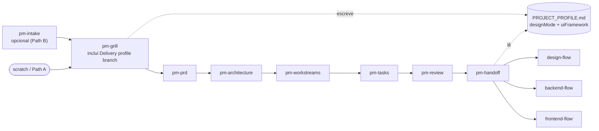
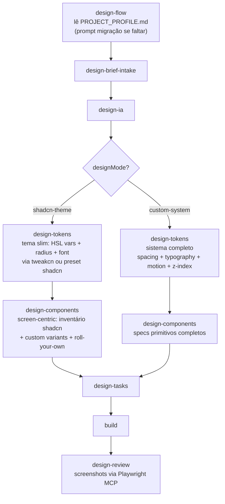
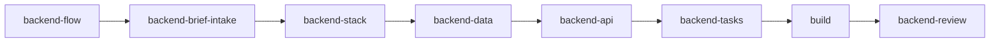
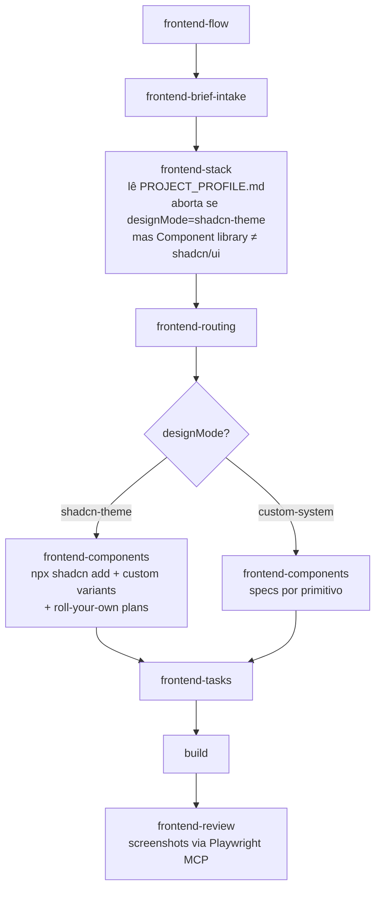
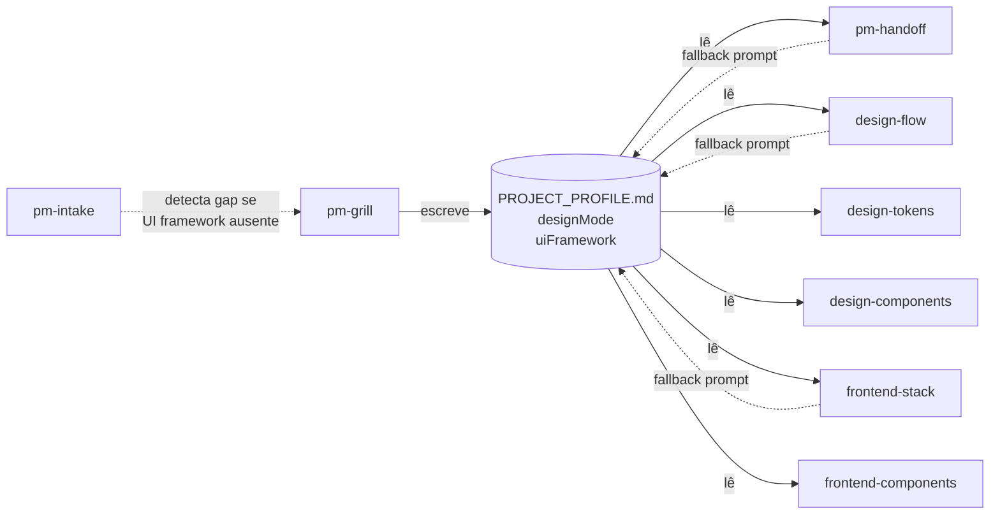

# Skills flow

All 35 skills, their artifacts, and the cross-cutting `PROJECT_PROFILE.md` contract rendered as mermaid diagrams. For a terminal-friendly ASCII view, see the main `README.md`.

---

## Top-level orchestration

```mermaid
flowchart TD
    Start([Idea or PRD draft]) --> PM[pm-flow]
    PM -->|pm-handoff| Design[design-flow]
    PM -->|pm-handoff| Backend[backend-flow]
    PM -->|pm-handoff| Frontend[frontend-flow]
    Design -.specs upstream.-> Frontend
    Backend -.API contracts.-> Frontend
    Design --> Build1[implementação]
    Backend --> Build2[implementação]
    Frontend --> Build3[implementação]
    Build1 --> DReview[design-review]
    Build2 --> BReview[backend-review]
    Build3 --> FReview[frontend-review]
    PM -.TASKS.md.-> Kanban[kanban-flow]
    Design -.DESIGN_TASKS.md.-> Kanban
    Backend -.BACKEND_TASKS.md.-> Kanban
    Frontend -.FRONTEND_TASKS.md.-> Kanban
```

---

## PM flow



---

## Design flow (com designMode branching)



Path B (sem DESIGN_BRIEF.md do pm-handoff): roda `design-grill` antes de `design-brief-intake`.

---

## Backend flow



---

## Frontend flow (com conflict check + designMode branching)



---

## Kanban flow

```mermaid
flowchart LR
    Flow[kanban-flow] --> Setup{Modo}
    Setup -->|setup 1ª vez| Preflight["pre-flight checks<br/>Atlassian MCP + projectKey<br/>+ issue types + Effort field"]
    Preflight --> Config[(".pm/jira-config.md")]
    Config --> Sync1["kanban-sync<br/>TASKS.md → Jira (idempotente)"]
    Setup -->|cycle| Sync2[kanban-sync]
    Setup -->|cycle| Status["kanban-status<br/>WIP + blockers + cycle time"]
    Setup -->|cycle| Pickup["kanban-pickup<br/>transition card + load contexto"]
    Sync1 -.JIRA_MAP.md.-> Sync2
```

---

## PROJECT_PROFILE.md — read/write map



Projetos legados sem o arquivo: qualquer um dos três pontos (`pm-handoff`, `design-flow`, `frontend-stack`) pergunta uma vez e grava — sem re-rodar `pm-grill`.

---

## Artefatos por disciplina

| Disciplina | Pasta | Arquivos |
|---|---|---|
| PM | `.pm/<feature>/` | `INTAKE.md`, `GRILL_SUMMARY.md`, **`PROJECT_PROFILE.md`**, `PRD.md`, `ARCHITECTURE.md`, `WORKSTREAMS.md`, `TASKS.md`, `REVIEW.md`, `JIRA_MAP.md` |
| Design | `.design/<feature>/` | `DESIGN_GRILL.md` (Path B), `DESIGN_BRIEF.md`, `CODEBASE_AUDIT.md`, `IA.md`, `TOKENS.md` (slim ou full conforme modo), `COMPONENT_SPECS.md` (screen-centric ou full conforme modo), `DESIGN_TASKS.md`, `DESIGN_REVIEW.md`, `screenshots/` |
| Backend | `.backend/<feature>/` | `BACKEND_BRIEF.md`, `BACKEND_INTAKE.md`, `BACKEND_STACK.md`, `BACKEND_DATA.md`, `BACKEND_API.md`, `BACKEND_TASKS.md`, `BACKEND_REVIEW.md` |
| Frontend | `.frontend/<feature>/` | `FRONTEND_BRIEF.md`, `FRONTEND_INTAKE.md`, `FRONTEND_STACK.md`, `FRONTEND_ROUTES.md`, `COMPONENT_PLAN.md`, `FRONTEND_TASKS.md`, `FRONTEND_REVIEW.md` |
| Kanban | `.pm/` | `jira-config.md` (global, first-run) |

Todos são markdown plano — editáveis à mão, versionáveis, diffáveis. Re-rodar uma skill atualiza seu arquivo; artefatos downstream se adaptam na próxima execução.
